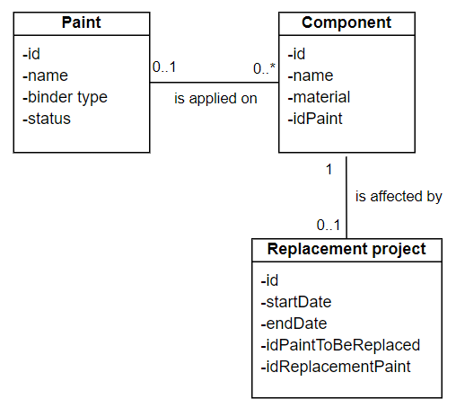

# REACH SAP to PBI (Data-to-Value)

## Table of contents
* [Description](https://github.com/svnagel/sap-reach-pbi?tab=readme-ov-file#description)
* [Use Case Scenario](https://github.com/svnagel/sap-reach-pbi?tab=readme-ov-file#use-case-scenario)
* [Objectives](https://github.com/svnagel/sap-reach-pbi?tab=readme-ov-file#objectives)
* [Data Dictionary](https://github.com/svnagel/sap-reach-pbi?tab=readme-ov-file#data-dictionary)
* [Class Diagram](https://github.com/svnagel/sap-reach-pbi?tab=readme-ov-file#class-diagram)
* [Prerequisites](https://github.com/svnagel/sap-reach-pbi?tab=readme-ov-file#prerequisites)
* [Sources](https://github.com/svnagel/sap-reach-pbi?tab=readme-ov-file#sources)

## Description
This project was inspired by a HAL thesis (Id: tel-03716180) in the context of the application of EU REACH regulation for French aeronautical equipment manufacturers. It addresses the notions of: data modelling, data pipeline and data visualisation.

## Use Case Scenario
REACH regulation in Europe has banned the use of hexavalent chromium (Chromium-6) compounds since September 21, 2017. The « Sermetel W » paint, currently used by our use case company « SAF » contains this chemical substance. Studies have suggested the paint « Maderbind CF » as a replacement for « Sermetel W ». Our company wishes to monitor the replacements of the « Sermetel W » painting lines. A regular meeting is organised with the environmental health and safety auditors (HSE Audit) to present progress KPIs.

## Objectives
The following KPI(s) will be monitored during HSE meetings:
* Percentage of REACH compliant components

## Data Dictionary
**Note** This dataset is an example and does not reflect the reality of any specific organisation.

### Paint Table
| **Name**    	| **Type** 	| **Description**                          	| **Example**                      	|
|-------------	|----------	|------------------------------------------	|----------------------------------	|
| id          	| number   	| paint identifier                         	| 01, 02                           	|
| name        	| text     	| name of the painting                     	| Sermetel W, Maderbind CF         	|
| binder type 	| text     	| chemical components of the binder        	| phosphate-chrome, sol-gel        	|
| status      	| text     	| status regarding the replacement project 	| in use, to be replaced, replaced 	|

### Component Table
| **Name** 	| **Type** 	| **Description**                              	| **Example**                  	|
|----------	|----------	|----------------------------------------------	|------------------------------	|
| id       	| number   	| component identifier                         	| 01, 02                       	|
| name     	| text     	| name of the component                        	| T rod, Straight rod          	|
| material 	| text     	| material of the component                    	| alloy steel, stainless steel 	|
| idPaint 	| number   	| associated painting identifier (foreign key) 	| 01, 02                       	|

### Replacement Project Table
| **Name**            	| **Type** 	| **Description**                        	| **Example** 	|
|---------------------	|----------	|----------------------------------------	|-------------	|
| id                  	| number   	| project replacement identifier         	| 01, 02      	|
| startDate           	| date     	| replacement project start date         	| 01/07/2024  	|
| endDate             	| date     	| replacement project end date           	| 31/12/2024  	|
| idPaintToBeReplaced 	| number   	| identifier of the paint to be replaced 	| 01, 02      	|
| idReplacementPaint  	| number   	| identifier of the replacement paint    	| 01, 02      	|

### Use case Example
Replacement of Sermetel W paint with Maderbind on all straight rods.

### Cardinality
#### Paint to Component
* A paint can be applied to several components 0..*
* A component has or does not have paint applied 0..1
#### Component to Replacement project
* A component has or does not have a replacement project affected 0..1
* A replacement project is assigned to one and only one component 1

## Class Diagram

**Note:** Database structure is simplified for the construction of the complete data pipeline (from SAP to PBI). Complexity can always be added later.

## Prerequisites

## Sources
* [Data Analyst SAP course catalog](https://learning.sap.com/browse/roles/data-analyst?access=free&page=1)
* [SAP S/4HANA Cloud trial](https://www.sap.com/products/erp/s4hana/trial.html)
* [SAP BTP (Business Technology Platform) Data-to-Value Bootcamp](https://github.com/SAP-samples/btp-data-to-value-workshop)
* [REACH Regulation](https://environment.ec.europa.eu/topics/chemicals/reach-regulation_en)
* [HAL thesis (Id: tel-03716180)](https://theses.hal.science/tel-03716180v1/document)
